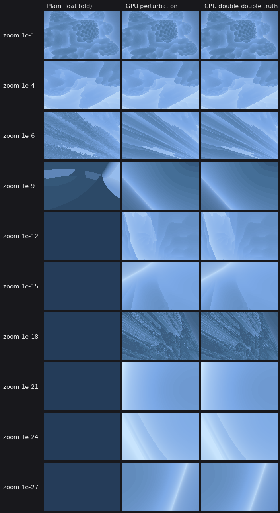

# Mandelbulb Perturbation Rendering

How the FractalRenderer plugin ray marches the Mandelbulb at zoom levels far beyond 32-bit float
precision, why each piece of maths is the way it is, and how it was verified. Every claim with a
number in it is reproduced by `Tools/PerturbationLab` (see its README).



*Same camera, same march, three ways to evaluate the distance estimator: plain float at absolute
coordinates (what the renderer did before), the GPU perturbation shader, and a CPU double-double
ground truth. Plain float is visibly wrong at 1e-6 and blank from 1e-9; perturbation matches the
ground truth down to 1e-27.*

---

## 1. Pipeline

```
                       CPU (double-double)                                 GPU (float)
 ┌──────────────────────────────────────────────────────┐   ┌───────────────────────────────────────────┐
 │ camera:  P_cam = Origin + (World - Anchor) * Scale   │   │ per pixel: dir = normalize(D00 + x*DX     │
 │ ray basis D00, DX, DY from the view matrices (double)│──►│                         + y*DY)          │
 │ reference ray: march the centre ray -> C_ref         │   │ march t:  dc = Scale*(CameraOffset+t*dir) │
 │ orbit Z_0..Z_N of C_ref + series skip (A_m, R_m)     │──►│ DE(dc): skip linear iterations, then      │
 │ CameraOffset = (P_cam - C_ref) / Scale   (per frame) │──►│   d <- g(Z_m+d) - g(Z_m) + dc  (exact)    │
 └──────────────────────────────────────────────────────┘   │   rebase when |Z_m + d| < |d|             │
                                                            └───────────────────────────────────────────┘
```

* **No absolute fractal coordinate ever reaches the GPU.** A march sample is
  `c = C_ref + dc` with `dc = Scale * (CameraOffset + t * dir)`, and its orbit is `z_n = Z_n + d_n`.
  Only `dc`, `d_n` (small) and the reference orbit values (rounded to float) are on the GPU.
* **The reference** is chosen by marching the view's centre ray on the CPU (the "high-precision ray"),
  in double while the zoom is shallow and double-double below `Scale < 1e-9`. It goes just past the
  surface if a non-escaping point is found there, otherwise on the hit point (or the closest approach
  when the centre ray misses). Thanks to rebasing (§4) any nearby point works; this choice just keeps
  `|dc|` small and the orbit long.
* **Latency.** `CameraOffset` is recomputed every frame in double-double, so a reference that is a
  few frames old is still exact. It is regenerated on a worker thread (rate-limited to 20 Hz while
  the camera moves). It is regenerated inline only when none exists, the formula changed, or the
  camera teleported far away. Typical cost: 0.2-2 ms for march + orbit (lab measurements, x86 CPU).

Code map:

| Piece | File |
|---|---|
| double-double arithmetic + transcendental functions | `Plugins/FractalRenderer/Source/FractalRenderer/Public/FractalMath/DoubleDouble.h` |
| power map (double / dd), orbit + series skip, packing, DE, reference-ray march | `.../FractalMath/MandelbulbReference.h` |
| UE view matrices → ray basis, UE matrix replicas for tests | `.../FractalMath/FractalCamera.h` |
| reference lifetime (sync/async regeneration), world↔fractal mapping | `.../FractalReference.{h,cpp}` |
| per-frame CPU→GPU constants, orbit upload, dispatch | `.../FractalSceneViewExtension.cpp` |
| GPU perturbation maths (pure HLSL) | `Plugins/FractalRenderer/Shaders/FractalPerturbation.ush` |
| GPU ray march + shading (pure HLSL) | `Plugins/FractalRenderer/Shaders/FractalRender.ush` |
| Unreal entry point (parameter binding only) | `Plugins/FractalRenderer/Shaders/PerturbationShader.usf` |

The `FractalMath/*.h` headers and the `.ush` files have no engine dependencies; the lab compiles the
same files (C++ with g++/clang, HLSL with DXC) and runs the HLSL on Vulkan.

---

## 2. Definitions (unchanged from the previous renderer)

```
r = |z|,  rho = sqrt(x^2 + y^2),  theta = atan2(rho, z) in [0, pi]  (angle from +Z),  phi = atan2(y, x)
g_p(z) = r^p ( sin(p theta) cos(p phi),  sin(p theta) sin(p phi),  cos(p theta) )
z_0 = 0,  z_{n+1} = g_p(z_n) + c,   escape when |z_n| > Bailout
dr_1 = 1, dr_{n+1} = p r_n^(p-1) dr_n + 1,   DE = 0.5 r ln(r) / dr      (scalar running derivative)
```

World axes are fractal axes (Unreal +Z = Mandelbulb polar axis). On the CPU, integer powers use the
trig-free form `r^p e^{ip theta} = r^p ((z + i rho)/r)^p`, `e^{ip phi} = ((x + i y)/rho)^p`, which equals
the trigonometric definition exactly and only needs + − × ÷ √ (cheap and exact in double-double).

---

## 3. The perturbation step: `g(Z + d) - g(Z)` without cancellation

The orbit of a sample is `z_n = Z_n + d_n` with

```
d_{n+1} = g(Z_n + d_n) - g(Z_n) + dc.
```

**Why the obvious implementation fails.** Evaluating `g(Z+d)` and `g(Z)` separately in float and
subtracting (what the old notes and the old shader did) leaves nothing once `|d| < 1e-7 |Z|`. The
difference cancels to noise, which is exactly the precision limit perturbation is supposed to
remove. The lab's single-step test shows this "naive" difference has 100% error for every
`|d|/|Z| ≤ 1e-10` (table in §7.2). The Mandelbrot shortcut `2Zd + d²` does not exist because `g` is
not a polynomial, so the difference has to be rewritten exactly. There is no published Mandelbulb
version of this as far as I could find; the formulation below is derived here and verified to
float precision in §7.

**Spherical coordinates of `W = Z + d` relative to `Z`**, every term free of cancellation:

```
dR    = (2 Z·d + d·d) / (|W| + |Z|)                                  -> s = dR / |Z|
drho  = ((2X + dx) dx + (2Y + dy) dy) / (rho_W + rho)
dphi  : angle from (X, Y) to (Wx, Wy):    cross = X dy - Y dx,   dot = X Wx + Y Wy
dtheta: angle from (Z, rho) to (Wz, rho_W) in the meridian plane:
                                          cross = Z drho - rho dz,  dot = rho rho_W + Z Wz
```

The two angle differences are exact for any `d`, small or large. `cross` is formed from `d` directly,
never as `X Wy - Y Wx`. The meridian vectors have lengths exactly `|Z|` and `|W|`, so
`(sin, cos) = (cross, dot) / (|Z||W|)`.

**Output difference.** With `T = p theta`, `P = p phi`, `u = (|W|/|Z|)^p - 1`:

```
g(W) - g(Z) = |Z|^p [ u f(T', P') + (f(T', P') - f(T, P)) ],   f = (sinT cosP, sinT sinP, cosT)
f(T', P') - f(T, P) = (dsinT cosP' + sinT dcosP,  dsinT sinP' + sinT dsinP,  dcosT)
```

and the four differences come from the rotation by `dT = p dtheta` (same for `dP`):

```
dsinT = sin(T + dT) - sin T = cos T sin dT - sin T vers dT,      vers a = 1 - cos a
dcosT = cos(T + dT) - cos T = -sin T sin dT - cos T vers dT
```

**Multiplying the angle by p without trig (integer powers).** The rotation `e^{i dtheta}` is kept as
`(V, S) = (vers, sin)` and raised to the p-th power by binary powering:

```
double:  S' = 2 S (1 - V),          V' = V (2 - V) + S^2
add b:   S' = S cos b + cos a S_b,  V' = V + V_b - V V_b + S S_b
```

All terms are non-negative for `|p a| < pi`, so `V` and `S` keep *relative* accuracy for tiny angles
(`cos a - 1` would cancel). The radial factor uses the same idea on `A = (1+s)^k - 1`:
`k→2k: A' = A(A+2)`, `k→k+1: A' = A(1+s) + s`. With `s ≥ -1/2` guaranteed (§4), no term cancels.
**For integer powers the GPU step uses no transcendental function at all.** Non-integer powers fall
back to `atan2` + `sincos` of the half angles (`sin(T+dT) - sin T = 2 cos(T + dT/2) sin(dT/2)`) and
`u = expm1(p log1p(s))`.

**When `|Z| ≤ |W|/2`** (right after a rebase, where `Z_0 = 0`) the plain difference has no
cancellation and `g(W)` is evaluated directly (path A).

### 3.1 Details that turned out to matter (each found by a failing test)

* **GPU transcendental functions are not accurate for small arguments.** D3D only guarantees an
  absolute error of 8e-4 for `sin`/`cos` (Microsoft's `sincos` docs; Wine's tests see ~1e-6 on NVIDIA).
  `sin(1e-20)` may come back as ~1e-6. `FractalPerturbation.ush` therefore implements `FP_SinCos`
  (Cody-Waite + minimax), `FP_Atan2` (single minimax polynomial, one division), `FP_Log1p`, and
  `FP_Expm1`, all with relative accuracy down to 1e-38. Hardware `exp2`/`log2` appear only where
  absolute accuracy suffices.
* **Coefficients on the polar axis.** `std::sin(8 * pi)` returns ~1e-15, not 0. That absolute error
  multiplies an O(1) azimuth difference and produced relative errors up to **1e14** for references
  on the axis. The CPU now computes `sin/cos(p theta)` with the complex power, which is exactly 0 on
  the axis and relatively accurate next to it.
* **Underflow near the axis.** At deep zoom, products like `X·dy` with `X, dy ~ 1e-20` underflow
  float (min normal 1.2e-38; GPUs flush denormals). The xy-plane quantities are rescaled by an exact
  power of two taken from the exponent bits (`FP_Pow2Normalizer`), which costs nothing and changes
  nothing else.
* **The φ branch cut.** Wrapping `phi + dphi` into (−π, π] is required for non-integer powers: it
  reproduces the formula's seam. For integer powers it is harmful, because it turns a small `dphi`
  into ≈2π and destroys the relative accuracy of the half angle (10⁻⁵ errors). It is applied only for
  non-integer powers.
* **Self-consistent reference data.** All per-point coefficients (`|Z|, rho, |Z|^p, 1/|Z|, sin/cos`)
  are computed in double from the *float-rounded* `Z~`, so the GPU computes `g(Z~+d) - g(Z~)` exactly
  for its own `Z~`. Using `Z~` instead of `Z` only changes the update by a relative `O(p·ε)`.

### 3.2 Distance estimator on top of the step

```
d = dc, m = 1, dr*Scale = Scale                    (z_1 = c, Z_1 = C_ref, dr_1 = 1)
skip:   find the largest m with R_m >= |dc|;  d = A_m dc,  dr*Scale = DR_m * Scale     (§5)
loop n: W = Z_m + d;  if |W| > Bailout -> escape
        if |W| < |d| or m is the last orbit point -> d = W, m = 0          (rebase, §4)
        d = step(Z_m, d) + dc;  dr*Scale = p |W|^(p-1) dr*Scale + Scale;  m++
DE_world = 0.5 |W| ln|W| / (dr*Scale)
```

The derivative is tracked multiplied by the world→fractal scale. That keeps it inside float range
at any depth (`dr` alone reaches ~1e33 at a scale of 1e-30), and it returns the DE directly in world
units for the march.

---

## 4. Rebasing and the reference orbit

* **Glitches.** A perturbed orbit loses precision when `|Z_m + d| << |Z_m|`, i.e. when the pixel passes
  much closer to the critical point (the origin) than the reference does (Pauldelbrot's criterion).
  Following Zhuoran's rebasing (also used by current 2D deep-zoom renderers), whenever `|Z_m + d| < |d|`
  the full value becomes the delta and the pixel continues against `Z_0 = 0`. The representation error
  of `d` is then `ε|z| < ε|d|`, so precision never gets worse. One reference serves the whole image.
* **The reference running out.** The orbit is iterated past the pixel bailout, up to
  `ReferenceEscapeRadius = 4 × Bailout` (bounded so `|Z|^p` stays in float range). If a pixel still
  has not escaped when the reference ends, then `|d| ≥ |Z| - |z| ≥ |z|`, so the forced rebase
  satisfies the rebasing condition automatically. The lab confirms that a reference *outside* the
  surface (a short, escaping orbit, like the camera position) is as accurate as one inside it (§7.3).
* **Reference precision.** Local rounding errors of the reference orbit enter every pixel identically
  and act like an image shift of `ε_ref·|C|`. They must stay well below the pixel spacing. Double
  references are good to a scale of ~1e-13; double-double (`ε ≈ 1e-32`) to ~1e-27/1e-28, which is where
  the measured error starts to grow (§7.3). The float deltas themselves would allow ~1e-30; the
  subsystem clamps the scale at 1e-30.

---

## 5. Linear series skip (the deep-zoom speed-up)

The number of iterations per distance estimate grows with zoom depth: 3 at 1e-1, 23 at 1e-12, 45 at
1e-24. The extra iterations are spent while `|d|` is still tiny next to `|Z|`, where each step is just
`d ← J_n d + dc` (`J_n` = Jacobian of `g` at `Z_n`). So `d_m = A_m dc` with `A_1 = I`,
`A_{n+1} = J_n A_n + I`. The CPU stores `A_m` (3×3), the reference's `dr_m`, and a validity radius:

```
R_m = min_{n<m} tol * min(|Z_n|, rho_n) / ||A_n||_F         (tol = 1e-8)
```

`|Z_n|` bounds the quadratic term `(p-1)/2 |d|/|Z|`. `rho_n` is there because `g` is not smooth on the
polar axis: its Hessian grows like 1/ρ, so the skip stops at the axis. It also stops once the reference
leaves the pixel bailout. Each sample binary-searches the deepest `m` with `R_m ≥ |dc|`
and starts iterating there (~8 dependent loads). Gotcha: `|dc|` must be bounded by `√3·max|dc_i|`, because `length(dc)`
squares ~1e-27 into 0 (flushed) and then skips everything. This was a real failure at 1e-27 in the lab.

Effect (lab, §7.4): 26% of iterations skipped at 1e-12, 54% at 1e-21, 64% at 1e-27. Executed iterations
per DE stay at **15-20 regardless of depth**. Frame time drops 3-4.5× at 1e-21..1e-27, with no accuracy
loss (median errors are even slightly lower, since fewer float iterations means less rounding).

---

## 6. CPU → GPU contract (`FPerturbationComputeShader::FParameters`)

| Parameter | Meaning | Computed |
|---|---|---|
| `RayDir00, RayDirDX, RayDirDY` | `dir(x, y) = D00 + x·DX + y·DY` (world, unnormalised), pixel indices relative to the view rect | `BuildRayBasis` (double) from `GetProjectionNoAAMatrix()` inverted and the rotation of `GetInvViewMatrix()` |
| `PixelRadiusPerUnitDistance` | half the angular pixel height; hit threshold = `t ×` this | same |
| `CameraOffset` | `(P_cam - C_ref) / Scale`, world units | double-double, every frame |
| `FractalScale` | fractal units per world unit (cm) | `FFractalCameraMapping::Scale` |
| `ReferenceCenter` | `float(C_ref)`; used only by the plain-float path | |
| `ReferenceOrbit`, `OrbitLength` | `StructuredBuffer<float4>`, 6 float4 per point (`FOrbitPointGPU`) | worker thread, uploaded each frame (~15 KB) |
| `DirectFootprint` | samples whose fractal-space pixel footprint exceeds this use plain float (hybrid, below) | `FFractalParameter::DirectEvaluationFootprint` (1e-4) |
| `OutputSize, OutputOffset` | view rect size and min; the output is written at `id + OutputOffset` | |

**Why a ray basis instead of matrices.** Three float3 vectors are independent of matrix packing
(row/column major), of reversed-Z conventions and of TAA jitter. For any perspective projection, the
view-space direction with `z = 1` is affine in pixel coordinates, so the basis is exact, not an
approximation. The lab verified that, with Unreal's matrices replicated
(`FRotationMatrix`, the view swizzle, `FReversedZPerspectiveMatrix`, `FMatrix::Inverse`):

* `mul(v, M)` in HLSL compiled with `-Zpr` (as Unreal does) equals the C++ `v * M` for an
  `FMatrix44f` uploaded verbatim, so the previous shader's matrix usage was correct;
* across 500 random cameras (pitch/yaw/roll, 20-90° FOV, 64-1964 px wide): the centre ray equals
  camera forward, the edge-to-edge angles equal the horizontal/vertical FOV, pixel (0,0) is top-left,
  and the basis matches both the per-pixel unprojection and the previous shader's `GetCameraRay`.
  All of these hold to < 6e-13 rad;
* rounding the basis to float costs at most 2.4e-4 of a pixel at 4K.

Fixed along the way: the old pass wrote to `DispatchThreadId` without the view-rect offset (wrong for
split screen / editor viewports with `ViewRect.Min != 0`). The projection now uses the unjittered
matrix, because the fractal is drawn after TAA/TSR.

**World ↔ fractal mapping.** `Fractal = Origin + (World - Anchor) × Scale`, with `Origin` in
double-double. With the defaults (`Origin = 0, Anchor = 0, Scale = 1e-5`) this is exactly the old
`Center + world × Zoom`. `ZoomAround(point, f)` moves the anchor to the point first, so zooming never
moves the camera. Unreal keeps using ordinary world coordinates; zooming rescales how far a world
centimetre travels in the fractal, so the pawn automatically slows down relative to the fractal as you
zoom in (mouse wheel).

---

## 7. Verification (Tools/PerturbationLab)

All GPU numbers come from running the *actual* `.ush` code, compiled by DXC 1.8 (the compiler
Unreal uses for SM6/Vulkan) with `-Zpr -O3 -HV 2021`, on Mesa lavapipe (Vulkan on the CPU). Ground
truth is `__float128` (113-bit) and, where even that is not enough, mpmath at 80 digits.

### 7.1 Building blocks
* double-double vs `__float128` (20k random cases each): add/mul/div/sqrt ≤ 8e-32 relative,
  sin/cos/atan2 ≤ 1e-31, exp/log ≤ 3e-30 (inherent conditioning), constants ≤ 2e-33.
* GPU elementary functions vs quad (200k cases): `FP_SinCos` 6e-8 relative for |x| ≥ 1e-38 and
  9e-8 absolute to |x| = 40; `FP_Atan2` 1.5e-7 relative down to angles of 1e-30; `FP_Log1p`/`FP_Expm1`
  ≤ 2.5e-7 relative.
* `DDSelfTest()` passes with clang `-O2 -ffast-math` thanks to `#pragma float_control(precise)`, and
  correctly *fails* with gcc `-ffast-math` (which ignores the pragma). The module logs an error if
  it ever fails in a shipped build. `Build.cs` additionally requests `FPSemantics = Precise`.

### 7.2 One perturbation step (`g(Z+d) - g(Z)`, power 8, ~30k cases, GPU float vs quad/mpmath exact)

| case | p50 error | max error | naive float p50 |
|---|---|---|---|
| generic, \|d\|/\|Z\| = 1e-25 … 1e0 | 8e-8 | 3.7e-7 | 100% wrong for ≤ 1e-10 |
| reference on the polar axis | 2.7e-7 | 1.7e-6 | 33% |
| reference within 1e-7…1e-1 of the axis | 9e-8 | 4.6e-6 | 100% |
| reference near the origin | 9e-8 | 3.6e-7 | 100% |
| large offsets, \|d\| ≈ \|Z\| | 3e-7 | 5.1e-6 | 5e-7 |

Powers 2 and 3 behave the same (max 1.4e-6). Power 7.5 (non-integer) is limited to ~4e-5 relative to
the natural scale, inherent to its discontinuous seams. Offsets with `|d|/|Z| < 1e-25` are checked with
mpmath (`scripts/verify_step_mpmath.py`): all ≤ 2e-6.

### 7.3 Distance estimator across zoom depths
For 4 surface locations (found by quad-precision marching), 14 depths from 1e-3 to 1e-29, two
reference choices (at the surface / 3 units outside it), 1000 samples within 4 world units each:

* down to **1e-27**: median DE error 8e-8…7e-6 world units (a pixel footprint at distance 1 is ~1e-3),
  median relative error ≤ 1.3e-5. Exact escape-iteration agreement is 91-100%; the misses are almost all
  ±1 or inside/outside flips right at the surface, where the DE error is negligible. Marching-relevant
  glitches (error > 10% of `max(DE, pixel)` on samples where double-double and quad agree): 0 in most
  rows, 12 in total over 104 rows. The worst row (9/1000) is the shallowest depth, 1e-3, where plain
  float has 22.
* plain float at the same samples: 10-80% wrong at 1e-5…1e-7, meaningless from 1e-9.
* 1e-29: errors grow to 1e-4…1e-3. This is the double-double reference limit (§4).
* **Numerically chaotic region.** Near the +z pole (the parabolic "bottleneck" of `x → x^8 + c` at
  `c_z ≈ 0.6527`), the azimuth is multiplied by 8 every iteration and the orbit lingers ~150
  iterations. The *exact* escape iteration changes between 40, 60 and 100 digits of working precision
  (`scripts/polar_chaos.py`; one point gives 400 / 126 / 153). No finite-precision renderer can draw
  this region faithfully. It is reported, not scored.

### 7.4 Full renders vs ground truth (192×120, 90° FOV, camera 2-6 world units from the surface)

| zoom | hit/miss agree | hit depth within 2 px | plain float depth ok | CPU ref (march+orbit) | series skip saves |
|---|---|---|---|---|---|
| 1e-1 | 100% | 100% | 100% | 0.3 ms | – |
| 1e-4 | 100% | 100% | 99.9% | 0.4 ms | – |
| 1e-6 | 100% | 100% | 52% | 0.2 ms | – |
| 1e-9 | 100% | 100% | 13% | 0.2 ms | 3% |
| 1e-12 | 100% | 100% | 0% | 0.5 ms | 26% |
| 1e-15 | 100% | 100% | 8% | 0.7 ms | 42% |
| 1e-18 | 99.98% | 99.93% | 9% | 0.3 ms | 43% |
| 1e-21 | 100% | 100% | 0% | 0.8 ms | 54% |
| 1e-24 | 100% | 100% | 13% | 2.1 ms | 56% |
| 1e-27 | 100% | 100% | 25% | 1.0 ms | 64% |

The ground truth runs the identical march with double-double positions and DE. The reference is
picked by the production `MarchReferenceRay`.

---

## 8. Performance

Per-iteration ALU cost (lab micro-benchmark on lavapipe, pure ALU, power 8; plus a DXIL instruction
count model for GPUs, where MUFU/division are relatively more expensive):

| iteration | lavapipe | DXIL cost model |
|---|---|---|
| previous shader (hardware acos/atan2/pow/sin/cos) | 2.5 ns | ~127 |
| new plain float, trig-free (power 8) | 2.4 ns | ~70 |
| perturbed step (path B, power 8) | 3.9 ns | ~160 |

* **Hybrid.** A march sample whose fractal-space pixel footprint exceeds `DirectEvaluationFootprint`
  (1e-4, ~1000× float's resolution near |c|≈2) uses the plain trig-free iteration, because absolute
  float coordinates resolve it exactly enough there. Shallow views cost what they did before, or less;
  deep views pay for perturbation only where needed.
* **Series skip** (§5) makes deep zoom cost roughly flat in depth.
* **Power-8 permutation** (`FP_STATIC_POWER_8`) drops the general-power code and unrolls the powering
  loops.
* `ConvergenceFactor` (the old early-out when the DE estimate stops changing) is now **0 by default**.
  Measured with the old 0.01: it barely reduced iterations (315.7 → 315.3, 1247 → 1218 per pixel) and
  dropped depth agreement to 91.4% at 1e-21.
* The CPU reference march uses double while `Scale > 1e-9` (≈10× faster) and double-double below;
  the orbit is always double-double.

---

## 9. Limits and next steps

* **Depth.** ~1e-27 (double-double reference). Deeper needs a quad-double/MPFR reference *and* float
  exponent extension on the GPU (float deltas underflow below ~1e-38; mathr's rescaling
  `z = S w` or float-exp), plus a split representation of `Scale`.
* **Non-integer powers** work (general path) but are slower and inherit the formula's seams.
* **Multiple views** share one reference manager; split screen with very different views would
  thrash it (keep one manager per view state if that matters).
* **Further speed:** a full BLA table (merged linear segments, usable after rebases), cone marching
  or a coarse-to-fine pre-pass, analytic normals for shading.
* **Not yet compiled inside Unreal.** The engine-free parts are compiled and tested; the `.usf`
  compiles with DXC for both permutations (`make ue-shader-check`), but the plugin C++ has not been
  built in a UE 5.6 editor in this environment.
